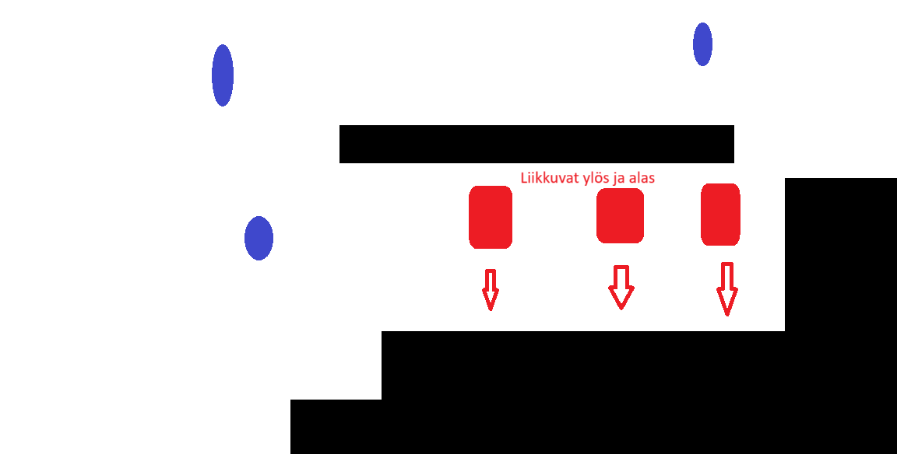

# Harjoitustyön suunnitelma

(Täydennä oman pelisi tiedot tähän tiedostoon muokkaamalla 
tiedostoa tekstieditorissa. Käytä [Markdown-syntaksia](https://about.gitlab.com/handbook/markdown-guide/).
Poista sitten *kaikki* suluilla merkityt kohdat.)

## Tietoja 

Tekijä: Lauri Uuksulainen

Työ git-varaston osoite: <https://github.com/Ukez1/ohj1ht> (*Korvaa* tämä osoite oman git-varastosi osoitteella)

Pelin nimi: Crystal Dungeon

Pelialusta: Windows 

Pelaajien lukumäärä: 2 

## Pelin tarina

Paha voima on päässyt irralleen ja saastuttanut voimaa tuottavat kristallit muodostaen niistä hirviöitä. 

## Pelin idea ja tavoitteet

Pelin ideana on kerätä vielä saastuttamattomat kristallit, tuhota viholliset sekä pyrkiä vapauttamaan kristallit pahan voiman vallasta. 

## Hahmotelma pelistä

## Toteutuksen suunnitelma

Helmikuu

- Toimivat viholliset
- Pistetaulukko 
- Pisteiden kerääminen (vihollisten tuhoaminen ja kristallien kerääminen)

Maaliskuu

- Pomo
- Hahmon aseet
- Liikkuvat objektit

Jos aikaa jää

- Lisäaseita
- Vaikuestasoja (helppo, tavallinen, vaikea)
- (Tavoite 3)
